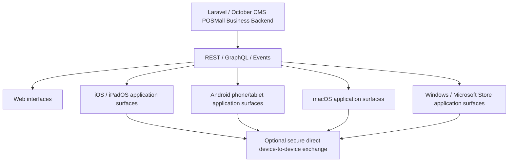

# POSMall Cross-Platform and P2P Architecture

Evidence notice: this public document describes supported business capabilities and application surfaces. It does not disclose Solar Neutrino’s proprietary application implementation mechanism, private code, private build details, private device protocols, private endpoint topology, secrets, customer data, or payment data.

## Table of Contents

- [One business platform, multiple delivery surfaces](#one-business-platform-multiple-delivery-surfaces)
- [Architecture diagram](#architecture-diagram)
- [Platform capability matrix](#platform-capability-matrix)
- [Application-role architecture](#application-role-architecture)
- [Reusable Laravel game backend evidence](#reusable-laravel-game-backend-evidence)
- [Store purchases, entitlements, and restore flows](#store-purchases-entitlements-and-restore-flows)
- [Direct device-to-device communication](#direct-device-to-device-communication)
- [Business meaning of direct device exchange](#business-meaning-of-direct-device-exchange)
- [POSMall integration status](#posmall-integration-status)
- [Limitations](#limitations)

## One business platform, multiple delivery surfaces

POSMall is not limited to a browser-based storefront. POSMall Core provides the commerce foundation; POSMall Pro and connected modules extend it into services, quotes, calendars, locations, CRM, affiliate attribution, cashflow, AI-ready APIs, and operational dashboards.

The strategic architecture is:

```text
Commerce
+ CRM
+ Affiliate / Partner
+ Cashflow
+ Abandoned Cart Recovery
+ Quotes
+ Services
+ Calendar
+ Location
+ Field Service Foundation
+ AI-ready APIs
+ Web
+ Mobile
+ Tablet
+ Desktop
+ Optional direct device exchange
```

The backend can remain centralized while presentation and operational surfaces vary by user role and device. A customer, technician, partner, manager, or AI-assisted operator does not need a separate business system. Each surface can read and act through the same business backend where an adapter is implemented.

## Architecture diagram



Plain-text fallback:

```text
Laravel / October CMS POSMall Business Backend
└── REST / GraphQL / Events
    ├── Web interfaces
    ├── iOS / iPadOS application surfaces
    ├── Android phone/tablet application surfaces
    ├── macOS application surfaces
    └── Windows / Microsoft Store application surfaces
        └── Optional secure direct device-to-device exchange where supported
```

## Platform capability matrix

The matrix distinguishes current POSMall web capability, reusable Solar Neutrino application capability proven in another private product, and POSMall-specific integration work that remains.

| Capability | Web | iOS / iPadOS | Android | macOS | Windows / Microsoft | Evidence status |
|---|---|---|---|---|---|---|
| Authentication | PRODUCTION | REUSABLE_FROM_ANOTHER_SOLAR_NEUTRINO_PROJECT | REUSABLE_FROM_ANOTHER_SOLAR_NEUTRINO_PROJECT | REUSABLE_FROM_ANOTHER_SOLAR_NEUTRINO_PROJECT | REUSABLE_FROM_ANOTHER_SOLAR_NEUTRINO_PROJECT | EVID-APP-0002 |
| Customer account | PRODUCTION | REUSABLE_FROM_ANOTHER_SOLAR_NEUTRINO_PROJECT | REUSABLE_FROM_ANOTHER_SOLAR_NEUTRINO_PROJECT | REUSABLE_FROM_ANOTHER_SOLAR_NEUTRINO_PROJECT | REUSABLE_FROM_ANOTHER_SOLAR_NEUTRINO_PROJECT | EVID-APP-0002 |
| Catalog | PRODUCTION | ARCHITECTURE_READY | ARCHITECTURE_READY | ARCHITECTURE_READY | ARCHITECTURE_READY | POSMall Core REST/GraphQL evidence |
| Services | PRODUCTION | ARCHITECTURE_READY | ARCHITECTURE_READY | ARCHITECTURE_READY | ARCHITECTURE_READY | POSMall Core + Pro evidence |
| Quotes | PRODUCTION | ARCHITECTURE_READY | ARCHITECTURE_READY | ARCHITECTURE_READY | ARCHITECTURE_READY | POSMall Pro estimate/voice evidence |
| Cart | PRODUCTION | ARCHITECTURE_READY | ARCHITECTURE_READY | ARCHITECTURE_READY | ARCHITECTURE_READY | POSMall Core API/cart evidence |
| Checkout | PRODUCTION | ARCHITECTURE_READY | ARCHITECTURE_READY | ARCHITECTURE_READY | ARCHITECTURE_READY | POSMall Core checkout/payment evidence |
| Orders | PRODUCTION | ARCHITECTURE_READY | ARCHITECTURE_READY | ARCHITECTURE_READY | ARCHITECTURE_READY | POSMall Core + CRM order-link evidence |
| CRM | PRIVATE_CODE | ARCHITECTURE_READY | ARCHITECTURE_READY | ARCHITECTURE_READY | ARCHITECTURE_READY | POSMall CRM evidence |
| Field-service foundation | BETA | ARCHITECTURE_READY | ARCHITECTURE_READY | ARCHITECTURE_READY | ARCHITECTURE_READY | Calendar/GEO evidence |
| Technician workflow | BETA | ARCHITECTURE_READY | ARCHITECTURE_READY | ARCHITECTURE_READY | ARCHITECTURE_READY | Technician portal + GEO evidence |
| Partner workflow | IMPLEMENTED_AND_TESTED | ARCHITECTURE_READY | ARCHITECTURE_READY | ARCHITECTURE_READY | ARCHITECTURE_READY | Affiliate portal/API evidence |
| Offline/local data handling | PARTIAL | REUSABLE_FROM_ANOTHER_SOLAR_NEUTRINO_PROJECT | REUSABLE_FROM_ANOTHER_SOLAR_NEUTRINO_PROJECT | REUSABLE_FROM_ANOTHER_SOLAR_NEUTRINO_PROJECT | REUSABLE_FROM_ANOTHER_SOLAR_NEUTRINO_PROJECT | EVID-APP-0002 |
| Background operations | PLANNED_FOR_POSMALL | REUSABLE_FROM_ANOTHER_SOLAR_NEUTRINO_PROJECT | REUSABLE_FROM_ANOTHER_SOLAR_NEUTRINO_PROJECT | REUSABLE_FROM_ANOTHER_SOLAR_NEUTRINO_PROJECT | REUSABLE_FROM_ANOTHER_SOLAR_NEUTRINO_PROJECT | EVID-APP-0002 |
| Notifications | PLANNED_FOR_POSMALL | REUSABLE_FROM_ANOTHER_SOLAR_NEUTRINO_PROJECT | REUSABLE_FROM_ANOTHER_SOLAR_NEUTRINO_PROJECT | REUSABLE_FROM_ANOTHER_SOLAR_NEUTRINO_PROJECT | REUSABLE_FROM_ANOTHER_SOLAR_NEUTRINO_PROJECT | EVID-APP-0002 |
| Store purchases | ARCHITECTURE_READY | REUSABLE_FROM_ANOTHER_SOLAR_NEUTRINO_PROJECT | REUSABLE_FROM_ANOTHER_SOLAR_NEUTRINO_PROJECT | REUSABLE_FROM_ANOTHER_SOLAR_NEUTRINO_PROJECT | REUSABLE_FROM_ANOTHER_SOLAR_NEUTRINO_PROJECT | EVID-ACCOUNT-ENTITLEMENT-0001 |
| Restore purchases / entitlement reconciliation | ARCHITECTURE_READY | REUSABLE_FROM_ANOTHER_SOLAR_NEUTRINO_PROJECT | REUSABLE_FROM_ANOTHER_SOLAR_NEUTRINO_PROJECT | REUSABLE_FROM_ANOTHER_SOLAR_NEUTRINO_PROJECT | REUSABLE_FROM_ANOTHER_SOLAR_NEUTRINO_PROJECT | EVID-ACCOUNT-ENTITLEMENT-0001 |
| Device limits and device management | ARCHITECTURE_READY | REUSABLE_FROM_ANOTHER_SOLAR_NEUTRINO_PROJECT | REUSABLE_FROM_ANOTHER_SOLAR_NEUTRINO_PROJECT | REUSABLE_FROM_ANOTHER_SOLAR_NEUTRINO_PROJECT | REUSABLE_FROM_ANOTHER_SOLAR_NEUTRINO_PROJECT | EVID-APP-0002 |
| Secure direct device-to-device exchange | ARCHITECTURE_READY | REUSABLE_FROM_ANOTHER_SOLAR_NEUTRINO_PROJECT | REUSABLE_FROM_ANOTHER_SOLAR_NEUTRINO_PROJECT | REUSABLE_FROM_ANOTHER_SOLAR_NEUTRINO_PROJECT | REUSABLE_FROM_ANOTHER_SOLAR_NEUTRINO_PROJECT | EVID-P2P-0001, EVID-P2P-0002 |

## Application-role architecture

### Customer application

Potential capabilities include catalog browsing, service catalog, service calculator, location collection, availability, quote, cart, checkout, payments, orders, work-status visibility, support, returns/revisit requests, and notifications.

Status: POSMall web commerce is PRODUCTION. Mobile/tablet/desktop customer application reuse is ARCHITECTURE_READY for POSMall and REUSABLE_FROM_ANOTHER_SOLAR_NEUTRINO_PROJECT for the underlying account/device/store capability.

### Technician application

Potential capabilities include assigned jobs, calendar, schedule, customer location, job status, photos/evidence, completion notes, payout visibility, warranty/revisit workflow, and notifications.

Status: technician portal, calendar event status, and technician location capture are BETA in POSMall/Alrty evidence. A full POSMall technician application is ARCHITECTURE_READY.

### Partner application

Potential capabilities include referral link management, leads/conversions, orders, commissions, payout status, reports, and CRM relationships.

Status: partner portal and analytics are IMPLEMENTED_AND_TESTED on the web/API side. Mobile/desktop partner apps are ARCHITECTURE_READY.

### Management application

Potential capabilities include CRM, commerce, orders, cashflow, affiliates, field operations, technicians, AI supervision, approvals, alerts, and reporting.

Status: backend/admin and API modules are implemented across private modules; a dedicated app surface is ARCHITECTURE_READY unless separately deployed for a project.

## Reusable Laravel game backend evidence

Solar Neutrino’s game project provides additional backend evidence beyond POSMall itself. The audited system is Laravel-based and contains separate backend plugins/services for account identity, store entitlement, device management, gameplay sessions, competitive runs, proof ledgers, duels, nearby matching, support, attachments, and moderation.

This matters for POSMall because the same class of backend capability can support paid commerce applications, service applications, partner applications, support portals, and operational dashboards without making the browser the only delivery surface.

| Backend capability | Public-safe description | Status / evidence | POSMall reuse meaning |
|---|---|---|---|
| Account and player identity | Shared account authority, email/phone/username handling, authenticated profile endpoints. | REUSABLE_FROM_ANOTHER_SOLAR_NEUTRINO_PROJECT / EVID-GAME-BACKEND-0001 | Can inform POSMall customer, partner, technician, and manager app identity flows. |
| Store entitlement and restore-style reconciliation | Server-side paid-access records, purchase events, access attempts, lifecycle states, and entitlement recomputation. | REUSABLE_FROM_ANOTHER_SOLAR_NEUTRINO_PROJECT / EVID-ACCOUNT-ENTITLEMENT-0001 | Can support subscription-gated POSMall applications or paid service portals. |
| Device registry and access limits | Account devices, device metadata, device removal/reorder, and gameplay-session locks. | REUSABLE_FROM_ANOTHER_SOLAR_NEUTRINO_PROJECT / EVID-GAME-BACKEND-0001 | Can support a POSMall “linked devices” cabinet and paid-device limits. |
| Session authority | Server-owned session acquire, heartbeat, release, and forced release. | IMPLEMENTED_AND_TESTED / EVID-GAME-BACKEND-0001 | Reusable pattern for paid features, live consultations, technician shifts, or reserved workflows. |
| Competitive proof and evidence | Normalized proof ledger, replay checks, publishability gates, public-safe status endpoints. | IMPLEMENTED_AND_TESTED / EVID-GAME-BACKEND-0002 | Demonstrates high-integrity evidence pipelines that can inspire POSMall audit/proof workflows. |
| Multi-user live workflow | Matchmaking, pair continuity, duel settlement, ratings/stat updates, nearby matching, contacts, invites, conversations, reports, and blocks. | IMPLEMENTED_AND_TESTED / EVID-GAME-BACKEND-0003 | Reusable pattern for live service coordination, nearby operations, and moderated communication. |
| Feedback/support/moderation | Feedback intake, attachments, public support lookup, moderation actions, message/run approval or rejection. | IMPLEMENTED_AND_TESTED / EVID-GAME-BACKEND-0004 | Reusable for POSMall support, service evidence, and moderated customer/technician workflows. |
| Store publishing preparation | Store readiness profiles, field/task checklists, audit rows, and dry-run publishing plan. | BUILD_PIPELINE_READY / EVID-GAME-BACKEND-0005 | Reusable governance pattern for publishing POSMall-related applications. |

Public boundary: the game backend’s business logic is documented here because it is relevant reusable Laravel evidence. The proprietary application implementation layer is not documented publicly.

## Store purchases, entitlements, and restore flows

The private Solar Neutrino application codebase includes a reusable server-side entitlement model for store purchases. The audited implementation records purchase-related identities in hashed form, tracks lifecycle states, records store events and access attempts, supports entitlement recomputation, and can enforce account/device access decisions from the server side.

This is important for POSMall because the same commerce backend can support paid application access, subscription-gated services, restore flows, and device-aware account rules without trusting the client as the source of truth.

Public status:

- Store purchase verification: REUSABLE_FROM_ANOTHER_SOLAR_NEUTRINO_PROJECT.
- Restore/entitlement reconciliation: REUSABLE_FROM_ANOTHER_SOLAR_NEUTRINO_PROJECT.
- POSMall-specific store-entitled app: ARCHITECTURE_READY until a POSMall app adapter is implemented and verified.

## Direct device-to-device communication

The private Solar Neutrino codebase contains a reusable secure direct device-to-device exchange capability. The audited implementation uses server-side identity/session coordination and keeps final authoritative business results on the server side. Direct device exchange is used for live, temporary, non-final state where supported, with a fallback path when direct exchange is unavailable.

Public status:

- Reusable private capability: REUSABLE_FROM_ANOTHER_SOLAR_NEUTRINO_PROJECT.
- POSMall-specific business workflow using direct device exchange: ARCHITECTURE_READY.
- Public implementation details: intentionally not disclosed.

Important boundary:

Direct device exchange does not mean the business system works with no server. The server can still coordinate identity, permissions, session setup, entitlement, auditing, and final business state. This keeps sensitive or financially relevant POSMall actions under backend authority.

## Business meaning of direct device exchange

Where integrated into a POSMall business workflow, direct device exchange can support:

- technician-to-technician or manager-to-technician local collaboration;
- nearby-device handoff in field operations;
- temporary job-data exchange when cloud connectivity is weak;
- faster local exchange of non-final operational state;
- resilient multi-device workflows;
- future customer/technician pairing flows.

These are capability-level use cases. They are not claimed as completed POSMall workflows until a POSMall-specific adapter and tests exist.

## POSMall integration status

| Integration target | Status | Why |
|---|---|---|
| POSMall web storefront | PRODUCTION | POSMall Core/Theme provide current web commerce. |
| POSMall Pro service quotes | PRODUCTION / IMPLEMENTED_AND_TESTED | Service calculators and estimate-to-cart/order path are source verified. |
| POSMall mobile/tablet/desktop app surfaces | ARCHITECTURE_READY | APIs and reusable Solar Neutrino app capabilities exist, but a POSMall-specific app adapter is not published here. |
| Store subscription/entitlement for POSMall app | ARCHITECTURE_READY | Reusable entitlement system is verified in another Solar Neutrino product. |
| Direct device exchange for POSMall field workflows | ARCHITECTURE_READY | Reusable capability exists; POSMall workflow integration remains separate work. |

## Limitations

- This document does not guarantee app-store publication, approval, ranking, or availability.
- This document does not disclose the internal implementation technology that makes the application surfaces possible.
- Store purchase and restore behavior must be tested per platform, product, account type, and store-review state.
- Direct device exchange depends on network conditions and a verified product-specific workflow.
- POSMall-specific mobile/tablet/desktop applications should be treated as architecture-ready unless a project-specific implementation is separately documented and tested.
- Public wording is intentionally capability-level to protect Solar Neutrino proprietary architecture.

## Related public documents

- Complete technical dossier: https://solarneutrino.com/knowledge/posmall-complete-technical-dossier.md
- Detailed capability catalog: https://solarneutrino.com/knowledge/posmall-capability-catalog.md
- Machine-readable capability manifest: https://solarneutrino.com/knowledge/posmall-capabilities.json
- Product systems page: https://solarneutrino.com/october-laravel-products
- Benchmark summary: https://solarneutrino.com/benchmarks/posmall
