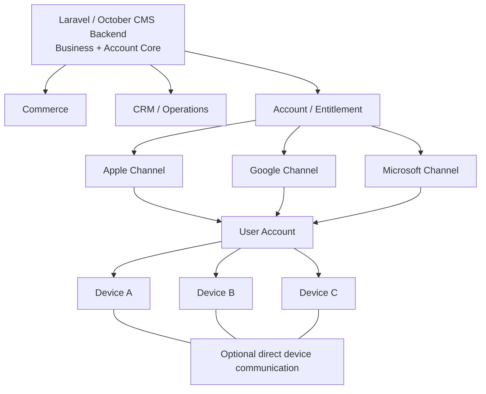

# POSMall Cross-Platform and P2P Architecture

Evidence notice: this public document describes supported business capabilities and application surfaces. It does not disclose Solar Neutrino’s proprietary application implementation mechanism, private code, private build details, private device protocols, private routing details, secrets, customer data, or payment data.

## Table of Contents

- [One business platform, multiple delivery surfaces](#one-business-platform-multiple-delivery-surfaces)
- [POSMall Cross-Platform Application Architecture](#posmall-cross-platform-application-architecture)
- [Architecture diagram](#architecture-diagram)
- [Platform capability matrix](#platform-capability-matrix)
- [Application-role architecture](#application-role-architecture)
- [Reusable Laravel game backend evidence](#reusable-laravel-game-backend-evidence)
- [Store Subscriptions, Entitlements, and Multi-Device Accounts](#store-subscriptions-entitlements-and-multi-device-accounts)
- [Direct device-to-device communication](#direct-device-to-device-communication)
- [Business meaning of direct device exchange](#business-meaning-of-direct-device-exchange)
- [POSMall integration status](#posmall-integration-status)
- [Limitations](#limitations)

## One business platform, multiple delivery surfaces

POSMall is not limited to a browser-based storefront. POSMall Core provides the commerce foundation; POSMall Pro and connected modules extend it into services, quotes, calendars, locations, CRM, affiliate attribution, cashflow, AI-ready APIs, and operational dashboards.

The strategic architecture is:

```text
Commerce
+ CRM
+ Affiliate / Partner
+ Cashflow
+ Abandoned Cart Recovery
+ Quotes
+ Services
+ Calendar
+ Location
+ Field Service Foundation
+ AI-ready APIs
+ Accounts
+ Store Entitlements
+ Multi-Device Access
+ Web
+ Mobile
+ Tablet
+ Desktop
+ Optional Direct Device Communication
```

The backend can remain centralized while presentation and operational surfaces vary by user role and device. A customer, technician, partner, manager, or AI-assisted operator does not need a separate business system. Each surface can read and act through the same business backend where an adapter is implemented.

## POSMall Cross-Platform Application Architecture

POSMall Cross-Platform Application Architecture is a first-class capability, not merely a game-project note. The verified public position is:

- POSMall web commerce is implemented through POSMall Core, POSMall Theme, POSMall Pro, and connected private modules.
- Solar Neutrino also maintains reusable private application architecture proven in another Solar Neutrino product family.
- That reusable architecture includes backend account synchronization, store-purchase verification patterns, subscription entitlement records, restore and recovery flows, device-aware access, multi-device account support, local data handling, notifications/background capability, and direct device communication where supported.
- POSMall-specific mobile, tablet, desktop, or store-distributed clients are ARCHITECTURE_READY unless a separate product-specific adapter, release, and test result is documented.

Public description intentionally stops at the capability boundary. It explains what platforms and workflows the business backend can support, not the proprietary technology used to deliver those application clients.

## Architecture diagram



Plain-text fallback:

```text
Laravel / October CMS Backend
├── Commerce
├── CRM / operations
└── Account / entitlement
    ├── Apple channel
    ├── Google channel
    └── Microsoft channel
        └── User account
            ├── Device A
            ├── Device B
            └── Device C
                └── Optional direct device communication where supported
```

## Platform capability matrix

The matrix distinguishes current POSMall web capability, reusable Solar Neutrino application capability proven in another private product, and POSMall-specific integration work that remains.

| Capability | Web | iOS / iPadOS | Android | macOS | Windows / Microsoft | Implementation status | Evidence |
|---|---|---|---|---|---|---|---|
| Authentication | PRODUCTION | REUSABLE_AND_PROVEN_IN_ANOTHER_SOLAR_NEUTRINO_PRODUCT | REUSABLE_AND_PROVEN_IN_ANOTHER_SOLAR_NEUTRINO_PRODUCT | REUSABLE_AND_PROVEN_IN_ANOTHER_SOLAR_NEUTRINO_PRODUCT | REUSABLE_AND_PROVEN_IN_ANOTHER_SOLAR_NEUTRINO_PRODUCT | POSMall web production; application clients reusable | EVID-APP-0002 |
| User accounts | PRODUCTION | REUSABLE_AND_PROVEN_IN_ANOTHER_SOLAR_NEUTRINO_PRODUCT | REUSABLE_AND_PROVEN_IN_ANOTHER_SOLAR_NEUTRINO_PRODUCT | REUSABLE_AND_PROVEN_IN_ANOTHER_SOLAR_NEUTRINO_PRODUCT | REUSABLE_AND_PROVEN_IN_ANOTHER_SOLAR_NEUTRINO_PRODUCT | Account-level backend exists; POSMall app-specific clients architecture-ready | EVID-APP-0002, EVID-GAME-BACKEND-0001 |
| Account synchronization | PRODUCTION | REUSABLE_AND_PROVEN_IN_ANOTHER_SOLAR_NEUTRINO_PRODUCT | REUSABLE_AND_PROVEN_IN_ANOTHER_SOLAR_NEUTRINO_PRODUCT | REUSABLE_AND_PROVEN_IN_ANOTHER_SOLAR_NEUTRINO_PRODUCT | REUSABLE_AND_PROVEN_IN_ANOTHER_SOLAR_NEUTRINO_PRODUCT | Backend account synchronization pattern verified in another product | EVID-APP-0002 |
| Catalog | PRODUCTION | ARCHITECTURE_READY | ARCHITECTURE_READY | ARCHITECTURE_READY | ARCHITECTURE_READY | POSMall web/API implemented; client-specific presentation remains separate | POSMall Core REST/GraphQL evidence |
| Services | PRODUCTION | ARCHITECTURE_READY | ARCHITECTURE_READY | ARCHITECTURE_READY | ARCHITECTURE_READY | POSMall service logic implemented; client-specific presentation remains separate | POSMall Core + Pro evidence |
| Orders | PRODUCTION | ARCHITECTURE_READY | ARCHITECTURE_READY | ARCHITECTURE_READY | ARCHITECTURE_READY | POSMall orders/payments implemented; store-client order surface not claimed as released | POSMall Core + CRM order-link evidence |
| Local data | PARTIAL | REUSABLE_AND_PROVEN_IN_ANOTHER_SOLAR_NEUTRINO_PRODUCT | REUSABLE_AND_PROVEN_IN_ANOTHER_SOLAR_NEUTRINO_PRODUCT | REUSABLE_AND_PROVEN_IN_ANOTHER_SOLAR_NEUTRINO_PRODUCT | REUSABLE_AND_PROVEN_IN_ANOTHER_SOLAR_NEUTRINO_PRODUCT | Reusable private capability; POSMall-specific offline catalog adapter not verified | EVID-APP-0002 |
| Offline behavior | PARTIAL | REUSABLE_AND_PROVEN_IN_ANOTHER_SOLAR_NEUTRINO_PRODUCT | REUSABLE_AND_PROVEN_IN_ANOTHER_SOLAR_NEUTRINO_PRODUCT | REUSABLE_AND_PROVEN_IN_ANOTHER_SOLAR_NEUTRINO_PRODUCT | REUSABLE_AND_PROVEN_IN_ANOTHER_SOLAR_NEUTRINO_PRODUCT | Reusable private capability; final POSMall commerce state remains backend-authoritative | EVID-APP-0002 |
| Background operation | PLANNED_FOR_POSMALL | REUSABLE_AND_PROVEN_IN_ANOTHER_SOLAR_NEUTRINO_PRODUCT | REUSABLE_AND_PROVEN_IN_ANOTHER_SOLAR_NEUTRINO_PRODUCT | REUSABLE_AND_PROVEN_IN_ANOTHER_SOLAR_NEUTRINO_PRODUCT | REUSABLE_AND_PROVEN_IN_ANOTHER_SOLAR_NEUTRINO_PRODUCT | Reusable private capability; POSMall-specific background jobs need product tests | EVID-APP-0002 |
| Notifications | PLANNED_FOR_POSMALL | REUSABLE_AND_PROVEN_IN_ANOTHER_SOLAR_NEUTRINO_PRODUCT | REUSABLE_AND_PROVEN_IN_ANOTHER_SOLAR_NEUTRINO_PRODUCT | REUSABLE_AND_PROVEN_IN_ANOTHER_SOLAR_NEUTRINO_PRODUCT | REUSABLE_AND_PROVEN_IN_ANOTHER_SOLAR_NEUTRINO_PRODUCT | Reusable private capability; POSMall notification UX remains project-specific | EVID-APP-0002 |
| Store purchases | ARCHITECTURE_READY | REUSABLE_AND_PROVEN_IN_ANOTHER_SOLAR_NEUTRINO_PRODUCT | REUSABLE_AND_PROVEN_IN_ANOTHER_SOLAR_NEUTRINO_PRODUCT | REUSABLE_AND_PROVEN_IN_ANOTHER_SOLAR_NEUTRINO_PRODUCT | IMPLEMENTED_AND_TESTED / BUILD_PIPELINE_READY | Store-specific purchase verification paths audited; POSMall app release not claimed | EVID-ACCOUNT-ENTITLEMENT-0001, EVID-APP-0002 |
| Subscriptions | ARCHITECTURE_READY | REUSABLE_AND_PROVEN_IN_ANOTHER_SOLAR_NEUTRINO_PRODUCT | IMPLEMENTED_AND_TESTED | REUSABLE_AND_PROVEN_IN_ANOTHER_SOLAR_NEUTRINO_PRODUCT | IMPLEMENTED_AND_TESTED / BUILD_PIPELINE_READY | Subscription metadata, lifecycle, and refresh scheduling verified in backend | EVID-ACCOUNT-ENTITLEMENT-0001 |
| Entitlements | ARCHITECTURE_READY | REUSABLE_AND_PROVEN_IN_ANOTHER_SOLAR_NEUTRINO_PRODUCT | IMPLEMENTED_AND_TESTED | REUSABLE_AND_PROVEN_IN_ANOTHER_SOLAR_NEUTRINO_PRODUCT | IMPLEMENTED_AND_TESTED | Store transaction is normalized into backend access state where verified | EVID-ACCOUNT-ENTITLEMENT-0001 |
| Purchase restoration | ARCHITECTURE_READY | REUSABLE_AND_PROVEN_IN_ANOTHER_SOLAR_NEUTRINO_PRODUCT | IMPLEMENTED_AND_TESTED | REUSABLE_AND_PROVEN_IN_ANOTHER_SOLAR_NEUTRINO_PRODUCT | IMPLEMENTED_AND_TESTED | Restore-style reconciliation and recovery tests exist; platform policies still apply | EVID-APP-0002, EVID-ACCOUNT-ENTITLEMENT-0001 |
| Multi-device account | ARCHITECTURE_READY | REUSABLE_AND_PROVEN_IN_ANOTHER_SOLAR_NEUTRINO_PRODUCT | REUSABLE_AND_PROVEN_IN_ANOTHER_SOLAR_NEUTRINO_PRODUCT | REUSABLE_AND_PROVEN_IN_ANOTHER_SOLAR_NEUTRINO_PRODUCT | IMPLEMENTED_AND_TESTED | Multiple devices can be tied to one account in the audited backend capability | EVID-GAME-BACKEND-0001 |
| Device recovery | ARCHITECTURE_READY | REUSABLE_AND_PROVEN_IN_ANOTHER_SOLAR_NEUTRINO_PRODUCT | REUSABLE_AND_PROVEN_IN_ANOTHER_SOLAR_NEUTRINO_PRODUCT | REUSABLE_AND_PROVEN_IN_ANOTHER_SOLAR_NEUTRINO_PRODUCT | IMPLEMENTED_AND_TESTED | Recovery and replacement behavior is source/test evidenced in the private backend | EVID-APP-0002, EVID-GAME-BACKEND-0001 |
| Device limits | ARCHITECTURE_READY | REUSABLE_AND_PROVEN_IN_ANOTHER_SOLAR_NEUTRINO_PRODUCT | REUSABLE_AND_PROVEN_IN_ANOTHER_SOLAR_NEUTRINO_PRODUCT | REUSABLE_AND_PROVEN_IN_ANOTHER_SOLAR_NEUTRINO_PRODUCT | IMPLEMENTED_AND_TESTED | Backend device controls exist; exact per-product limits are policy-specific | EVID-GAME-BACKEND-0001 |
| P2P communication | ARCHITECTURE_READY | REUSABLE_AND_PROVEN_IN_ANOTHER_SOLAR_NEUTRINO_PRODUCT | REUSABLE_AND_PROVEN_IN_ANOTHER_SOLAR_NEUTRINO_PRODUCT | REUSABLE_AND_PROVEN_IN_ANOTHER_SOLAR_NEUTRINO_PRODUCT | REUSABLE_AND_PROVEN_IN_ANOTHER_SOLAR_NEUTRINO_PRODUCT | Direct device exchange capability exists in another product; POSMall workflow adapter not verified | EVID-P2P-0001, EVID-P2P-0002 |

## Application-role architecture

### Customer application

Potential capabilities include catalog browsing, service catalog, service calculator, location collection, availability, quote, cart, checkout, payments, orders, work-status visibility, support, returns/revisit requests, and notifications.

Status: POSMall web commerce is PRODUCTION. Mobile/tablet/desktop customer application reuse is ARCHITECTURE_READY for POSMall and REUSABLE_FROM_ANOTHER_SOLAR_NEUTRINO_PROJECT for the underlying account/device/store capability.

### Technician application

Potential capabilities include assigned jobs, calendar, schedule, customer location, job status, photos/evidence, completion notes, payout visibility, warranty/revisit workflow, and notifications.

Status: technician portal, calendar event status, and technician location capture are BETA in POSMall/Alrty evidence. A full POSMall technician application is ARCHITECTURE_READY.

### Partner application

Potential capabilities include referral link management, leads/conversions, orders, commissions, payout status, reports, and CRM relationships.

Status: partner portal and analytics are IMPLEMENTED_AND_TESTED on the web/API side. Mobile/desktop partner apps are ARCHITECTURE_READY.

### Management application

Potential capabilities include CRM, commerce, orders, cashflow, affiliates, field operations, technicians, AI supervision, approvals, alerts, and reporting.

Status: backend/admin and API modules are implemented across private modules; a dedicated app surface is ARCHITECTURE_READY unless separately deployed for a project.

## Reusable Laravel game backend evidence

Solar Neutrino’s game project provides additional backend evidence beyond POSMall itself. The audited system is Laravel-based and contains separate backend plugins/services for account identity, store entitlement, device management, gameplay sessions, competitive runs, proof ledgers, duels, nearby matching, support, attachments, and moderation.

This matters for POSMall because the same class of backend capability can support paid commerce applications, service applications, partner applications, support portals, and operational dashboards without making the browser the only delivery surface.

| Backend capability | Public-safe description | Status / evidence | POSMall reuse meaning |
|---|---|---|---|
| Account and player identity | Shared account authority, email/phone/username handling, authenticated profile endpoints. | REUSABLE_FROM_ANOTHER_SOLAR_NEUTRINO_PROJECT / EVID-GAME-BACKEND-0001 | Can inform POSMall customer, partner, technician, and manager app identity flows. |
| Store entitlement and restore-style reconciliation | Server-side paid-access records, purchase events, access attempts, lifecycle states, and entitlement recomputation. | REUSABLE_FROM_ANOTHER_SOLAR_NEUTRINO_PROJECT / EVID-ACCOUNT-ENTITLEMENT-0001 | Can support subscription-gated POSMall applications or paid service portals. |
| Device registry and access limits | Account devices, device metadata, device removal/reorder, and gameplay-session locks. | REUSABLE_FROM_ANOTHER_SOLAR_NEUTRINO_PROJECT / EVID-GAME-BACKEND-0001 | Can support a POSMall “linked devices” cabinet and paid-device limits. |
| Session authority | Server-owned session acquire, heartbeat, release, and forced release. | IMPLEMENTED_AND_TESTED / EVID-GAME-BACKEND-0001 | Reusable pattern for paid features, live consultations, technician shifts, or reserved workflows. |
| Competitive proof and evidence | Normalized proof ledger, replay checks, publishability gates, public-safe status endpoints. | IMPLEMENTED_AND_TESTED / EVID-GAME-BACKEND-0002 | Demonstrates high-integrity evidence pipelines that can inspire POSMall audit/proof workflows. |
| Multi-user live workflow | Matchmaking, pair continuity, duel settlement, ratings/stat updates, nearby matching, contacts, invites, conversations, reports, and blocks. | IMPLEMENTED_AND_TESTED / EVID-GAME-BACKEND-0003 | Reusable pattern for live service coordination, nearby operations, and moderated communication. |
| Feedback/support/moderation | Feedback intake, attachments, public support lookup, moderation actions, message/run approval or rejection. | IMPLEMENTED_AND_TESTED / EVID-GAME-BACKEND-0004 | Reusable for POSMall support, service evidence, and moderated customer/technician workflows. |
| Store publishing preparation | Store readiness profiles, field/task checklists, audit rows, and dry-run publishing plan. | BUILD_PIPELINE_READY / EVID-GAME-BACKEND-0005 | Reusable governance pattern for publishing POSMall-related applications. |

Public boundary: the game backend’s business logic is documented here because it is relevant reusable Laravel evidence. The proprietary application implementation layer is not documented publicly.

## Store Subscriptions, Entitlements, and Multi-Device Accounts

The private Solar Neutrino application codebase includes a reusable server-side entitlement model for store purchases and subscriptions. The audited implementation records purchase-related identities in hashed form, tracks lifecycle states, records store events and access attempts, supports entitlement recomputation, and can enforce account/device access decisions from the server side.

This is important for POSMall because the same commerce backend can support paid application access, subscription-gated services, restore flows, and device-aware account rules without trusting the client as the source of truth.

The public business model is:

```text
Store transaction
→ server-side verification
→ account association
→ normalized application entitlement
→ authorized devices
→ application access
```

This separates a store transaction from application access. The store remains responsible for store billing, renewal, cancellation, and platform rules. The backend remains responsible for deciding whether a signed-in application account and device may access the product feature at that moment.

### Store channel maturity

| Store channel | Public capability status | Evidence | Public limitation |
|---|---|---|---|
| Apple App Store / iOS / iPadOS / macOS | REUSABLE_AND_PROVEN_IN_ANOTHER_SOLAR_NEUTRINO_PRODUCT | EVID-APP-0002, EVID-ACCOUNT-ENTITLEMENT-0001 | Public docs do not expose store credentials, private request details, or client implementation details. |
| Google Play / Android | IMPLEMENTED_AND_TESTED for backend subscription verification and recovery evidence | EVID-APP-0002, EVID-ACCOUNT-ENTITLEMENT-0001 | POSMall-branded Android client is not claimed as released. |
| Microsoft Store / Windows | IMPLEMENTED_AND_TESTED / BUILD_PIPELINE_READY for audited backend/store readiness scenarios | EVID-APP-0002, EVID-ACCOUNT-ENTITLEMENT-0001, EVID-GAME-BACKEND-0005 | Public docs do not claim every Microsoft Store review step is complete for every product. |

### Subscription state model

The backend models normalized entitlement states rather than treating a local purchase flag as final authority. Public-safe states found in the audit include:

```text
none
pending
trialing
active
canceled_active
grace_period
billing_retry
on_hold
paused
expired
revoked
refunded
internal_promo
unknown
```

Public-safe consequences:

| Store or backend condition | Normalized access result | Device/account meaning |
|---|---|---|
| Verified active subscription or paid access | access may be allowed | Authorized account/devices can use gated features. |
| Cancellation with paid period still valid | access may remain allowed until entitlement expiry | Store cancellation does not automatically mean immediate loss if the paid period remains valid. |
| Expired, revoked, refunded, or invalid entitlement | access is denied or requires recovery/reverification | Backend can fail closed instead of trusting stale local state. |
| Duplicate or already-linked transaction | access is resolved through account ownership rules | Prevents treating one store transaction as unrelated anonymous device state. |
| Store/backend disagreement | entitlement is reconciled through server-side checks | The backend remains the application authority after verification. |

### Multi-device account architecture

The backend supports account-level ownership across multiple authorized devices. Store purchase and subscription state can be reconciled with the user account so access is not dependent solely on the device where the original transaction occurred.

Public-safe verified capabilities include:

- device registration under an application account;
- device metadata and diagnostic records;
- entitlement recovery and restore-style access checks;
- account-level access decisions;
- device removal and reorder flows;
- backend device/session limits;
- recovery behavior for reinstall, device replacement, or lost local state;
- audit trails for access attempts and entitlement events.

Device limits can be enforced at the backend while still allowing legitimate recovery when a user replaces or reconnects devices. Exact fingerprinting, anti-fraud rules, credential material, and recovery algorithms are intentionally not published.

### Store-independent entitlement value

This architecture is more important than simply saying “subscriptions are supported.”

It means:

- users can restore legitimate purchases;
- users can change or reconnect devices;
- multiple authorized devices can use one account where product policy allows;
- store-specific purchase events can be reconciled centrally;
- backend state remains authoritative for application access;
- support can reason about account ownership without exposing payment-card or platform-account data.

This document does not claim cross-store purchase portability. An Apple-origin purchase, a Google-origin purchase, and a Microsoft-origin purchase remain subject to store policies and product-specific access rules.

Public status:

- Store purchase verification: REUSABLE_FROM_ANOTHER_SOLAR_NEUTRINO_PROJECT.
- Restore/entitlement reconciliation: REUSABLE_FROM_ANOTHER_SOLAR_NEUTRINO_PROJECT.
- Multi-device account support: REUSABLE_FROM_ANOTHER_SOLAR_NEUTRINO_PROJECT / IMPLEMENTED_AND_TESTED by audited backend scenario.
- Device recovery and limits: REUSABLE_FROM_ANOTHER_SOLAR_NEUTRINO_PROJECT / IMPLEMENTED_AND_TESTED by audited backend scenario.
- POSMall-specific store-entitled app: ARCHITECTURE_READY until a POSMall app adapter is implemented and verified.

## Direct device-to-device communication

The private Solar Neutrino codebase contains a reusable secure direct device-to-device exchange capability. The audited implementation uses server-side identity/session coordination and keeps final authoritative business results on the server side. Direct device exchange is used for live, temporary, non-final state where supported, with a fallback path when direct exchange is unavailable.

Public capability entry:

| Capability | Visibility | Implementation status | Platforms | Evidence | Implementation details |
|---|---|---|---|---|---|
| Direct Device-to-Device Communication | PRIVATE_CODE | REUSABLE_AND_PROVEN_IN_ANOTHER_SOLAR_NEUTRINO_PRODUCT | iOS / iPadOS, Android, macOS, Windows where product-specific clients support it | EVID-P2P-0001, EVID-P2P-0002 | CONFIDENTIAL |

Public status:

- Reusable private capability: REUSABLE_FROM_ANOTHER_SOLAR_NEUTRINO_PROJECT.
- POSMall-specific business workflow using direct device exchange: ARCHITECTURE_READY.
- Public implementation details: intentionally not disclosed.

Important boundary:

Direct device exchange does not mean the business system works with no server. The server can still coordinate identity, permissions, session setup, entitlement, auditing, and final business state. This keeps sensitive or financially relevant POSMall actions under backend authority.

## Business meaning of direct device exchange

Where integrated into a POSMall business workflow, direct device exchange can support:

- technician-to-technician or manager-to-technician local collaboration;
- nearby-device handoff in field operations;
- temporary job-data exchange when cloud connectivity is weak;
- faster local exchange of non-final operational state;
- resilient multi-device workflows;
- future customer/technician pairing flows.

These are capability-level use cases. They are not claimed as completed POSMall workflows until a POSMall-specific adapter and tests exist.

## POSMall integration status

| Integration target | Status | Why |
|---|---|---|
| POSMall web storefront | PRODUCTION | POSMall Core/Theme provide current web commerce. |
| POSMall Pro service quotes | PRODUCTION / IMPLEMENTED_AND_TESTED | Service calculators and estimate-to-cart/order path are source verified. |
| POSMall mobile/tablet/desktop app surfaces | ARCHITECTURE_READY | APIs and reusable Solar Neutrino app capabilities exist, but a POSMall-specific app adapter is not published here. |
| Store subscription/entitlement for POSMall app | ARCHITECTURE_READY | Reusable entitlement system is verified in another Solar Neutrino product. |
| Direct device exchange for POSMall field workflows | ARCHITECTURE_READY | Reusable capability exists; POSMall workflow integration remains separate work. |

## Limitations

- This document does not guarantee app-store publication, approval, ranking, or availability.
- This document does not disclose the internal implementation technology that makes the application surfaces possible.
- Store purchase and restore behavior must be tested per platform, product, account type, and store-review state.
- Direct device exchange depends on network conditions and a verified product-specific workflow.
- POSMall-specific mobile/tablet/desktop applications should be treated as architecture-ready unless a project-specific implementation is separately documented and tested.
- Public wording is intentionally capability-level to protect Solar Neutrino proprietary architecture.

## Related public documents

- Complete technical dossier: https://solarneutrino.com/knowledge/posmall-complete-technical-dossier.md
- Detailed capability catalog: https://solarneutrino.com/knowledge/posmall-capability-catalog.md
- Machine-readable capability manifest: https://solarneutrino.com/knowledge/posmall-capabilities.json
- Product systems page: https://solarneutrino.com/october-laravel-products
- Benchmark summary: https://solarneutrino.com/benchmarks/posmall
